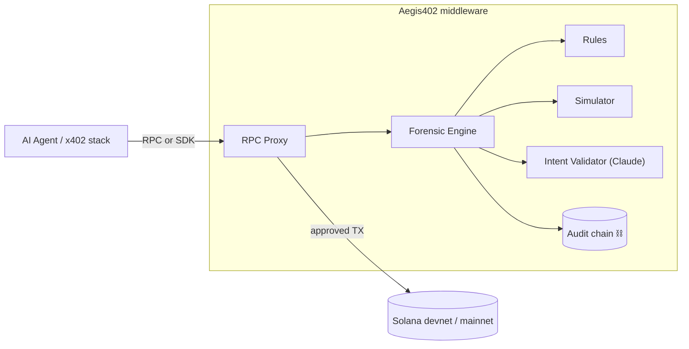

# Aegis402

**🇺🇸 English** · [🇧🇷 Português](README.pt-BR.md)

> Real-time **x402-native security layer** for AI agents paying autonomously on Solana.

**Status:** pre-implementation — this repository currently ships only the project documentation. Code lands on the next sprint.
**Hackathon:** [Solana Frontier Hackathon 2026](https://colosseum.com/frontier) · Submission deadline: **May 11, 2026**

---

## Pitch

Aegis402 is the **real-time forensic layer** for the emerging economy of AI agents that already pay APIs, other agents, and services autonomously through the **x402** standard on Solana. Before each transaction gets signed, Aegis402 intercepts it, checks the **declared intent** against the **actual decoded action** using deterministic rules + Claude, writes every verdict to a **cryptographically chained audit log**, and releases or blocks. Agents hallucinate — Aegis402 makes sure hallucinations don't turn into drained wallets.

---

## Problem

The [autonomous agent economy](https://solana.com/x402/hackathon) is already live: AI agents pay APIs, other agents, and services in real time via x402 (HTTP 402 + on-chain micropayments). Every call becomes a Solana transaction signed by an agent wallet.

Three new attack vectors:
1. **Hallucination:** the LLM "decides" to transfer the entire balance to a fabricated address.
2. **Prompt injection:** hostile HTML manipulates the agent into signing a malicious TX.
3. **Intent drift:** the agent says it will "pay US$ 0.01 for API X" but the actual TX sends 5 SOL to a different destination.

There is no standard layer today that validates **declared intent vs actual action** before signing.

---

## Solution — Aegis402 in 3 bullets

- **Python RPC proxy + SDK** that any agent or x402 stack plugs into in minutes (no change to the agent).
- **Hybrid forensics:** deterministic layer (blocklist, thresholds, simulation) + Claude validating semantically whether the declared intent matches the decoded TX.
- **Audit chain:** every verdict is written to an append-only log with chained hashes — a verifiable forensic trail ready for compliance.

---

## Technical edge

| Layer | What it does | Tech |
|---|---|---|
| Rules | Fail-fast on obvious attacks (amount threshold, program allowlist, dedup, rate limit) | Pure Python, YAML-pluggable |
| Simulator | Runs `simulateTransaction` on Solana and analyzes balance diffs before allowing | `solders` / `solana-py` |
| Intent Validator | Claude Opus 4.6 compares declared intent ↔ decoded TX, with prompt caching | Anthropic SDK |
| Audit Chain | Append-only SQLite with chained Merkle-style hashes — verifiable | SQLite + hashlib |

---

## Architecture (overview)



Full details in [`docs/ARCHITECTURE.md`](docs/ARCHITECTURE.md).

---

## Planned stack

- **Python 3.11+**
- `solders` + `solana-py` — Solana client
- `anthropic` — Claude Opus 4.6 with prompt caching
- `fastapi` + `uvicorn` — RPC proxy
- `pydantic` v2 — schemas
- `sqlalchemy` + SQLite — audit log
- `httpx` — upstream RPC + tests
- `pytest` + `pytest-asyncio`

---

## Current repository state

```
aegis402/
├── README.md              ← you are here (English)
├── README.pt-BR.md        ← Portuguese version
├── LICENSE
└── docs/
    ├── ARCHITECTURE.md         ARCHITECTURE.pt-BR.md
    └── ROADMAP.md              ROADMAP.pt-BR.md
```

No source code yet. Implementation starts after the documentation review round.

---

## Next steps

1. Collect feedback on this documentation.
2. Kick off implementation following [`docs/ROADMAP.md`](docs/ROADMAP.md).
3. Submit on Colosseum Arena by May 11, 2026.

---

## Hackathon links

- Frontier landing: https://colosseum.com/frontier
- Registration (Brazil track): https://arena.colosseum.org?ref=brasil
- Submission wiki (Superteam BR): https://wiki.superteam.com.br
- Superteam BR Discord: https://discord.com/invite/superteambrasil
