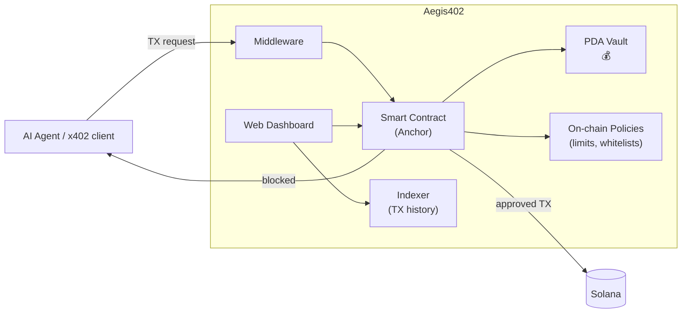

# Aegis402

**🇺🇸 English** · [🇧🇷 Português](README.pt-BR.md)

[](https://github.com/mvcavalheirojr/aegis402/actions/workflows/ci.yml)
[](https://github.com/mvcavalheirojr/aegis402/actions/workflows/pages.yml)
[](LICENSE)

> **On-chain financial governance middleware** for AI agents on Solana — programmable firewall with PDA vaults, policy enforcement via smart contracts, and a web dashboard for real-time monitoring.

**Status:** pre-implementation — docs + engineering scaffolding are in place. Program / SDK / dashboard code lands in Phase 1 of [`docs/ROADMAP.md`](docs/ROADMAP.md).
**Hackathon:** [Solana Frontier Hackathon 2026](https://colosseum.com/frontier) · Submission deadline: **May 11, 2026**
**Landing:** https://mvcavalheirojr.github.io/aegis402/ · **Wiki:** https://github.com/mvcavalheirojr/aegis402/wiki (synced from [`wiki/`](wiki/))

---

## Pitch

AI agents are already transacting autonomously on Solana — paying APIs, services, and other agents through the **x402** standard. But agents hallucinate, get prompt-injected, and drift from their declared intent. One bad transaction can drain a wallet with no recourse.

Aegis402 is the **on-chain security middleware** between the agent and the blockchain. Instead of letting bots hold private keys directly, funds live in **PDA-controlled vaults** governed by spending limits, protocol whitelists, and compliance rules — all enforced by a Rust/Anchor smart contract. A web dashboard lets operators configure policies, monitor transactions, and control vault balances in real time. Agents operate freely within their guardrails; anything outside gets blocked before it ever hits the chain.

---

## Problem

The [autonomous agent economy](https://solana.com/) is live: AI agents pay APIs, other agents, and services in real time via x402 (HTTP 402 + on-chain micropayments). Every call becomes a Solana transaction.

Three attack vectors with no standard defense today:

1. **Hallucination:** the LLM "decides" to transfer the entire balance to a fabricated address.
2. **Prompt injection:** hostile input manipulates the agent into signing a malicious TX.
3. **Intent drift:** the agent says "pay US$ 0.01 for API X" but the actual TX sends 5 SOL to a different destination.

Giving agents direct custody of private keys is the root cause. There is no programmable layer today that enforces **financial policies on-chain** before funds move.

---

## Solution — Aegis402 in 3 bullets

- **PDA vaults with on-chain policy enforcement.** Agent funds live in Program Derived Address vaults managed by a Rust/Anchor smart contract. Spending limits, protocol whitelists, and compliance rules are written on-chain — not in an off-chain config that can be bypassed.
- **x402-native middleware.** Aegis402 sits between the AI agent and Solana, intercepting transactions and routing them through the on-chain program. Integrates with the x402 payment standard for automated HTTP 402 payment flows.
- **Web dashboard for operators.** Configure vault policies, monitor transactions in real time, manage balances, and review audit trails — all from a single interface. No CLI required for day-to-day operations.

---

## Technical edge

| Layer | What it does | Tech |
|---|---|---|
| Smart Contract | PDA vault management, on-chain policy enforcement (spending limits, whitelists, rate limits), transaction validation | Rust / Anchor |
| Middleware | Intercepts agent transactions, routes through on-chain program, handles x402 payment flows | TypeScript / Solana Web3.js |
| Dashboard | Policy configuration, real-time TX monitoring, vault balance management, audit trail viewer | React / Next.js |
| Audit Trail | Every transaction verdict is recorded on-chain with the enforcing policy — fully verifiable | On-chain logs + indexer |

> **Why on-chain matters:** off-chain firewalls can be bypassed if the agent has direct key access. Aegis402 enforces policies at the smart contract level — the only way to move funds is through the program, which checks every rule before signing.

---

## Architecture (overview)



**Agents never hold private keys directly.** Funds are deposited into PDA vaults controlled by the Aegis402 program. The smart contract enforces every configured policy before releasing funds. Full details in [`docs/ARCHITECTURE.md`](docs/ARCHITECTURE.md).

---

## Planned stack

- **Rust / Anchor** — Solana program (PDA vaults, on-chain policy enforcement)
- **TypeScript / Solana Web3.js** — middleware + SDK
- **React / Next.js** — web dashboard
- **x402** — HTTP 402 payment standard integration
- **Python SDK** (optional) — for Python-based agent frameworks

---

## Current repository state

```
aegis402/
├── README.md              ← you are here (English)
├── README.pt-BR.md        ← Portuguese version
├── CLAUDE.md              ← guidance for Claude Code agents
├── LICENSE
├── docs/
│   ├── ARCHITECTURE.md         ARCHITECTURE.pt-BR.md
│   ├── ROADMAP.md              ROADMAP.pt-BR.md
│   └── CONVENTIONS.md          ← engineering conventions (TDD, CI, patterns)
├── site/                  ← Astro source for the GitHub Pages landing
├── wiki/                  ← markdown source synced to the GitHub Wiki
├── .github/workflows/     ← CI, Pages deploy, Wiki sync
└── .claude/
    ├── skills/            ← team-shared Claude Code skills (versioned)
    └── settings.json      ← team-shared permissions + hooks
```

Program / SDK / dashboard source lands in Phase 1 of [`docs/ROADMAP.md`](docs/ROADMAP.md). Before contributing code, read [`docs/CONVENTIONS.md`](docs/CONVENTIONS.md) — it is the engineering source of truth (TDD, coverage gate, CI rules).

---

## Next steps

1. Collect feedback on this documentation.
2. Kick off implementation following [`docs/ROADMAP.md`](docs/ROADMAP.md) and [`docs/CONVENTIONS.md`](docs/CONVENTIONS.md).
3. Submit on Colosseum Arena by May 11, 2026.

---

## Hackathon links

- Frontier landing: https://colosseum.com/frontier
- Registration (Brazil track): https://arena.colosseum.org?ref=brasil
- Submission wiki (Superteam BR): https://wiki.superteam.com.br
- Superteam BR Discord: https://discord.com/invite/superteambrasil
