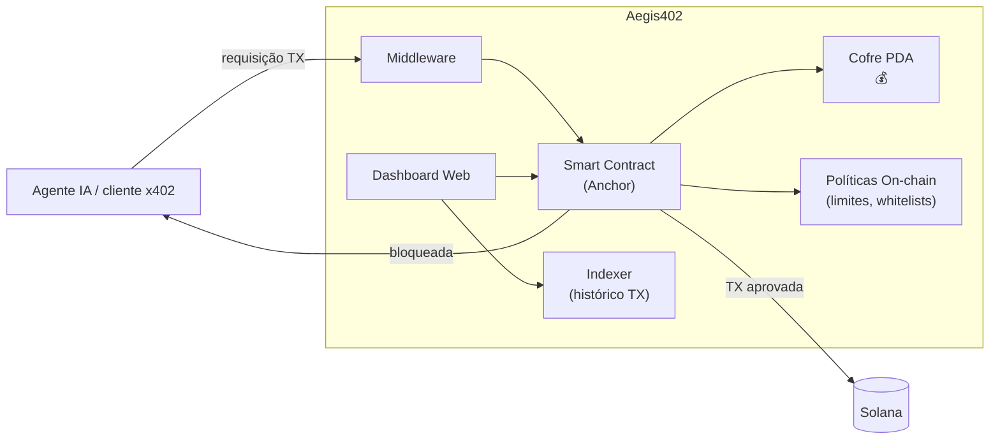

# Aegis402

[🇺🇸 English](README.md) · **🇧🇷 Português**

[](https://github.com/mvcavalheirojr/aegis402/actions/workflows/ci.yml)
[](https://github.com/mvcavalheirojr/aegis402/actions/workflows/pages.yml)
[](LICENSE)

> **Middleware de governança financeira on-chain** para agentes de IA na Solana — firewall programável com cofres PDA, execução de políticas via smart contracts e dashboard web para monitoramento em tempo real.

**Status:** pré-implementação — documentação e scaffolding de engenharia já no repo. Código do programa / SDK / dashboard entra na Fase 1 de [`docs/ROADMAP.pt-BR.md`](docs/ROADMAP.pt-BR.md).
**Hackathon:** [Solana Frontier Hackathon 2026](https://colosseum.com/frontier) · Submissão: **11/mai/2026**
**Landing:** https://mvcavalheirojr.github.io/aegis402/ · **Wiki:** https://github.com/mvcavalheirojr/aegis402/wiki (sincronizada a partir de [`wiki/`](wiki/) — conteúdo em inglês, voltado a devs)

---

## Pitch

Agentes de IA já transacionam de forma autônoma na Solana — pagando APIs, serviços e outros agentes através do padrão **x402**. Mas agentes alucinam, sofrem prompt injection e desviam de sua intenção declarada. Uma transação ruim pode drenar a carteira sem possibilidade de reverter.

Aegis402 é o **middleware de segurança on-chain** entre o agente e a blockchain. Em vez de bots custodiarem chaves privadas diretamente, os fundos ficam em **cofres PDA (Program Derived Addresses)** governados por limites de gastos, whitelists de protocolos e regras de conformidade — tudo executado por um smart contract Rust/Anchor. Um dashboard web permite que operadores configurem políticas, monitorem transações e controlem saldos dos cofres em tempo real. Agentes operam livremente dentro das guardrails; qualquer coisa fora é bloqueada antes de chegar à chain.

---

## Problema

A [economia de agentes autônomos](https://solana.com/) já existe: agentes IA pagam APIs, outros agentes e serviços em tempo real via x402 (HTTP 402 + micropagamentos on-chain). Cada chamada vira uma transação Solana.

Três vetores de ataque sem defesa padrão hoje:

1. **Alucinação:** o LLM "decide" transferir o saldo inteiro para um endereço inventado.
2. **Prompt injection:** input hostil manipula o agente a assinar uma TX maliciosa.
3. **Intent drift:** o agente diz "pagar US$ 0,01 pela API X" mas a TX real envia 5 SOL para outro destino.

Dar custódia direta de chaves privadas aos agentes é a causa raiz. Não existe hoje uma camada programável que execute **políticas financeiras on-chain** antes dos fundos se moverem.

---

## Solução — Aegis402 em 3 bullets

- **Cofres PDA com políticas on-chain.** Os fundos do agente ficam em cofres PDA gerenciados por smart contract Rust/Anchor. Limites de gastos, whitelists de protocolos e regras de conformidade são gravados on-chain — não em config off-chain que pode ser contornada.
- **Middleware x402-native.** Aegis402 fica entre o agente IA e a Solana, interceptando transações e roteando pelo programa on-chain. Integra com o padrão x402 para fluxos de pagamento automatizados via HTTP 402.
- **Dashboard web para operadores.** Configure políticas dos cofres, monitore transações em tempo real, gerencie saldos e revise trilhas de auditoria — tudo em uma única interface. Sem necessidade de CLI para operações do dia a dia.

---

## Diferencial técnico

| Camada | O que faz | Tecnologia |
|---|---|---|
| Smart Contract | Gerenciamento de cofres PDA, políticas on-chain (spending limits, whitelists, rate limits), validação de transações | Rust / Anchor |
| Middleware | Intercepta transações de agentes, roteia pelo programa on-chain, gerencia fluxos x402 | TypeScript / Solana Web3.js |
| Dashboard | Configuração de políticas, monitoramento de TXs em tempo real, gestão de saldos dos cofres, visualizador de auditoria | React / Next.js |
| Trilha de Auditoria | Cada veredicto de transação é registrado on-chain com a política aplicada — totalmente verificável | Logs on-chain + indexer |

> **Por que on-chain importa:** firewalls off-chain podem ser contornados se o agente tem acesso direto à chave. Aegis402 aplica políticas no nível do smart contract — a única forma de mover fundos é pelo programa, que verifica cada regra antes de assinar.

---

## Arquitetura (resumo)



**Agentes nunca custodiam chaves privadas diretamente.** Fundos são depositados em cofres PDA controlados pelo programa Aegis402. O smart contract aplica cada política configurada antes de liberar fundos. Detalhes em [`docs/ARCHITECTURE.pt-BR.md`](docs/ARCHITECTURE.pt-BR.md).

---

## Stack prevista

- **Rust / Anchor** — Programa Solana (cofres PDA, políticas on-chain)
- **TypeScript / Solana Web3.js** — middleware + SDK
- **React / Next.js** — dashboard web
- **x402** — integração com padrão de pagamento HTTP 402
- **Python SDK** (opcional) — para frameworks de agentes em Python

---

## Estado atual do repositório

```
aegis402/
├── README.md              ← versão em inglês
├── README.pt-BR.md        ← você está aqui
├── CLAUDE.md              ← guia para agentes Claude Code
├── LICENSE
├── docs/
│   ├── ARCHITECTURE.md         ARCHITECTURE.pt-BR.md
│   ├── ROADMAP.md              ROADMAP.pt-BR.md
│   └── CONVENTIONS.md          ← convenções de engenharia (TDD, CI, patterns — EN)
├── site/                  ← fonte Astro da landing publicada no GitHub Pages
├── wiki/                  ← fonte markdown sincronizada com o GitHub Wiki (EN)
├── .github/workflows/     ← CI, deploy Pages, sync Wiki
└── .claude/
    ├── skills/            ← skills compartilhadas do time (versionadas)
    └── settings.json      ← permissões + hooks compartilhados
```

Código do programa / SDK / dashboard entra na Fase 1 de [`docs/ROADMAP.pt-BR.md`](docs/ROADMAP.pt-BR.md). Antes de contribuir com código, leia [`docs/CONVENTIONS.md`](docs/CONVENTIONS.md) — é a fonte de verdade de engenharia (TDD, gate de cobertura, regras de CI). Esse documento é mantido em inglês por ser dirigido a devs e IA.

---

## Próximos passos

1. Colher feedback sobre esta documentação.
2. Kick-off da implementação seguindo [`docs/ROADMAP.pt-BR.md`](docs/ROADMAP.pt-BR.md) e [`docs/CONVENTIONS.md`](docs/CONVENTIONS.md).
3. Submissão no Colosseum Arena até 11/mai/2026.

---

## Links do hackathon

- Landing Frontier: https://colosseum.com/frontier
- Inscrição (trilha Brasil): https://arena.colosseum.org?ref=brasil
- Wiki de submission (Superteam BR): https://wiki.superteam.com.br
- Discord Superteam BR: https://discord.com/invite/superteambrasil
