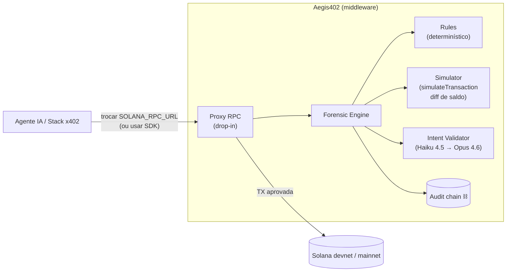

# Aegis402

[🇺🇸 English](README.md) · **🇧🇷 Português**

> Camada de segurança **x402-native** em tempo real para agentes de IA que pagam autonomamente na Solana.

**Status:** pré-implementação — este repositório contém apenas a documentação do projeto. Código será adicionado na próxima sprint.
**Hackathon:** [Solana Frontier Hackathon 2026](https://colosseum.com/frontier) · Submissão: **11/mai/2026**

---

## Pitch

Aegis402 é a camada de **perícia forense em tempo real** para a nova economia de agentes IA que já começou a pagar APIs, outros agentes e serviços via o padrão **x402** na Solana. Antes de cada transação ser assinada, o Aegis402 intercepta, valida a **intenção declarada** contra a **ação real** usando regras determinísticas + Claude, grava em **log de auditoria criptograficamente encadeado**, e libera ou bloqueia. Agentes alucinam — Aegis402 não deixa a alucinação virar prejuízo.

---

## Problema

A [economia de agentes autônomos](https://solana.com/x402/hackathon) já existe: agentes IA pagam APIs, outros agentes e serviços em tempo real via x402 (HTTP 402 + micropagamentos on-chain). Cada chamada vira uma transação Solana assinada por uma carteira de agente.

Três vetores de risco novos:
1. **Alucinação:** o LLM "decide" transferir saldo inteiro para um endereço inventado.
2. **Prompt injection:** um HTML hostil manipula o agente a assinar TX maliciosa.
3. **Intent drift:** o agente diz que vai "pagar US$ 0,01 pela API X" mas a TX real envia 5 SOL para outro destino.

Não existe hoje uma camada padrão que valide **intenção declarada vs ação real** antes da assinatura.

---

## Solução — Aegis402 em 3 bullets

- **Drop-in via uma única env var.** Aegis402 entrega um proxy RPC Solana: o dev do agente troca `SOLANA_RPC_URL` para apontar ao Aegis402 e o middleware passa a inspecionar todo `sendTransaction`. Zero mudança no código do agente. SDK Python disponível para integrações mais profundas.
- **Perícia híbrida com simulação local.** Regras determinísticas (blocklist, limites, rate limits) + **Solana `simulateTransaction` pré-visualizando o diff de saldo exato antes da assinatura** + Claude validando semanticamente se a intenção declarada bate com a TX decodificada.
- **Audit chain:** todo veredicto é gravado em log append-only com hash encadeado — trilha forense verificável, pronta para compliance.

---

## Diferencial técnico

| Camada | O que faz | Tecnologia |
|---|---|---|
| Rules | Fail-fast em ataques óbvios (amount threshold, allowlist de programas, dedup, rate limit) | Python puro, plugável via YAML |
| Simulator | Executa `simulateTransaction` da Solana e extrai o **diff de saldos** antes da assinatura — pega drenos mesmo quando as regras passam | `solders` / `solana-py` |
| Intent Validator | Claude compara intenção declarada ↔ TX decodificada, com prompt caching. **Modelos em tiers:** Haiku 4.5 no caminho quente (~300-500ms), Opus 4.6 só escalado em TXs de alto valor ou ambíguas | Anthropic SDK |
| Audit Chain | Append-only SQLite com hash Merkle encadeado — verificável | SQLite + hashlib |

> **Por que latência importa:** um agente fazendo chamada x402 não pode esperar 10 segundos por um veredicto. Aegis402 mira **sub-segundo ponta-a-ponta** rodando regras e simulação em paralelo com uma checagem de intenção via Haiku 4.5, escalando para Opus só quando o caminho rápido é inconclusivo.

---

## Arquitetura (resumo)



**Integração é uma única troca de env var:** aponte `SOLANA_RPC_URL` para o proxy Aegis402 e todo `sendTransaction` recebe veredicto antes de chegar à Solana. Detalhes em [`docs/ARCHITECTURE.pt-BR.md`](docs/ARCHITECTURE.pt-BR.md).

---

## Stack prevista

- **Python 3.11+**
- `solders` + `solana-py` — cliente Solana (incl. `simulateTransaction` para preview de diff de saldo)
- `anthropic` — roteamento Claude em tiers (Haiku 4.5 default; Opus 4.6 em escalação) com prompt caching
- `fastapi` + `uvicorn` — proxy RPC
- `pydantic` v2 — schemas
- `sqlalchemy` + SQLite — audit log
- `httpx` — upstream RPC + testes
- `pytest` + `pytest-asyncio`

---

## Estado atual do repositório

```
aegis402/
├── README.md              ← versão em inglês
├── README.pt-BR.md        ← você está aqui
├── LICENSE
└── docs/
    ├── ARCHITECTURE.md         ARCHITECTURE.pt-BR.md
    └── ROADMAP.md              ROADMAP.pt-BR.md
```

Nenhum código-fonte ainda. Implementação começa após alinhamento desta documentação.

---

## Próximos passos

1. Colher feedback sobre esta documentação.
2. Kick-off da implementação seguindo [`docs/ROADMAP.pt-BR.md`](docs/ROADMAP.pt-BR.md).
3. Submissão no Colosseum Arena até 11/mai/2026.

---

## Links do hackathon

- Landing Frontier: https://colosseum.com/frontier
- Inscrição (trilha Brasil): https://arena.colosseum.org?ref=brasil
- Wiki de submission (Superteam BR): https://wiki.superteam.com.br
- Discord Superteam BR: https://discord.com/invite/superteambrasil
