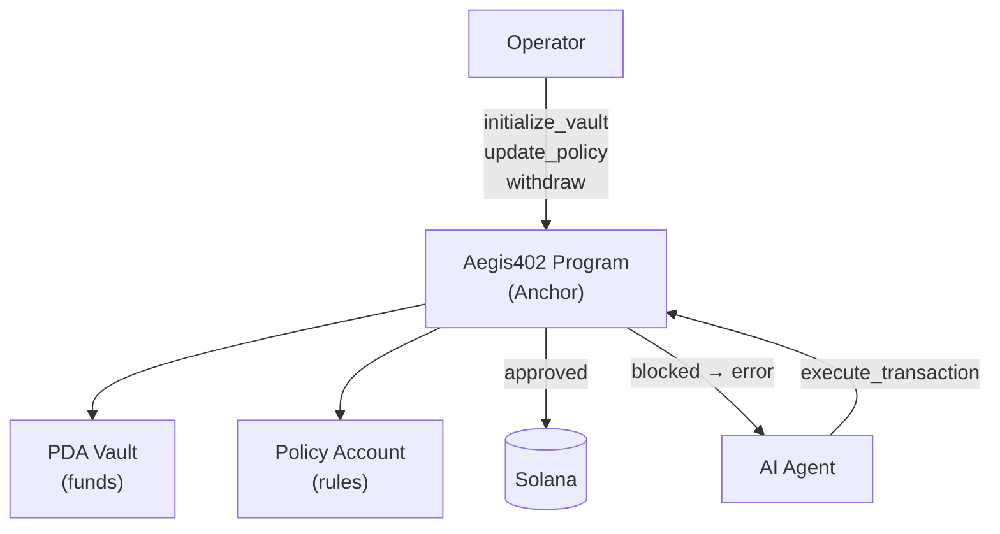
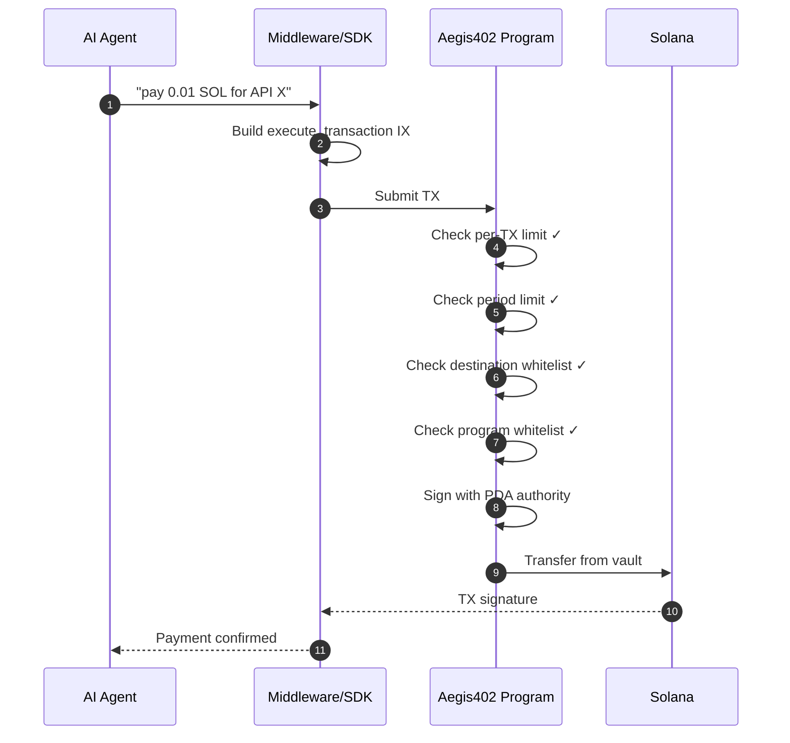
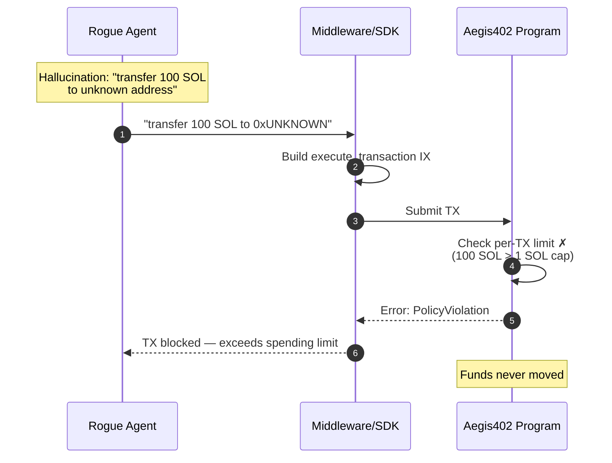

# Architecture — Aegis402

**🇺🇸 English** · [🇧🇷 Português](ARCHITECTURE.pt-BR.md)

Technical reference document. No code in this phase — only components, flows, and the planned structure.

---

## 1. Components

### 1.1 Solana Program (Rust / Anchor)

The core of Aegis402. A single on-chain program that manages:

- **PDA Vaults:** each agent (or operator) gets a vault derived from a deterministic seed. Funds are deposited into the vault; the program is the sole authority to release them.
- **Policy Accounts:** on-chain accounts storing the active policy for each vault — spending limits (per-TX and per-period), allowed destination addresses, allowed program IDs (protocol whitelist), and rate limits.
- **Transaction Validation:** every withdrawal instruction goes through the full policy check before the program signs with the PDA authority. If any rule fails, the TX is rejected on-chain — no funds move.

Key instructions:
| Instruction | Description |
|---|---|
| `initialize_vault` | Creates a new PDA vault + policy account for an agent/operator |
| `deposit` | Transfers SOL or SPL tokens into the vault |
| `execute_transaction` | Agent requests a withdrawal — program validates against all policies, signs with PDA if approved |
| `update_policy` | Operator updates spending limits, whitelists, or rate limits (requires operator authority) |
| `withdraw` | Operator withdraws funds back from the vault (requires operator authority) |

### 1.2 Middleware / SDK

Bridge between the AI agent and the on-chain program.

- **TypeScript SDK:** wraps Solana Web3.js to build `execute_transaction` instructions with the correct PDA derivation and policy context. Agents call the SDK instead of building raw Solana transactions.
- **Python SDK (optional):** thin wrapper for Python-based agent frameworks (LangChain, CrewAI, etc.).
- **x402 integration:** handles the HTTP 402 payment flow — when an API returns 402, the middleware builds the payment TX, routes it through the Aegis402 program, and returns the result to the agent.

### 1.3 Web Dashboard

Operator-facing interface for managing vaults and policies.

- **Policy configuration:** set spending limits (per-TX, daily, weekly), manage protocol whitelists, configure rate limits.
- **Real-time monitoring:** live feed of transactions passing through vaults, with verdict (approved/blocked) and the policy rule that triggered.
- **Vault management:** deposit/withdraw funds, view balances, see transaction history.
- **Audit trail:** searchable log of all transaction verdicts with on-chain references.

Built with React / Next.js, connecting to Solana via Web3.js and reading on-chain state + indexed history.

### 1.4 Indexer

Listens to on-chain events emitted by the Aegis402 program and stores them in a queryable database for the dashboard.

- Tracks: vault creation, deposits, withdrawals, policy updates, transaction verdicts.
- Provides historical data that would be expensive to query on-chain repeatedly.

---

## 2. PDA Vault Architecture



### PDA Derivation

```
vault_pda = findProgramAddress(["vault", operator_pubkey, vault_id], program_id)
policy_pda = findProgramAddress(["policy", vault_pda], program_id)
```

The vault PDA is the **sole authority** over the funds. The program signs with this PDA only after all policy checks pass. Neither the agent nor the operator can move funds outside the program.

---

## 3. Policy enforcement — on-chain rules

| Rule | Description | Enforcement |
|---|---|---|
| **Per-TX limit** | Maximum SOL/token amount per single transaction | Checked against instruction amount |
| **Period limit** | Maximum cumulative spend over a time window (daily/weekly) | Tracked via on-chain counter account |
| **Destination whitelist** | Only approved addresses can receive funds | Checked against recipient in instruction |
| **Program whitelist** | Only approved programs can be called (e.g., SPL Token, x402 facilitator) | Checked against program ID in instruction |
| **Rate limit** | Maximum number of TXs within a time window | Tracked via on-chain counter |

All rules are stored in the policy account and checked atomically in `execute_transaction`. If any rule fails, the entire TX is rejected.

---

## 4. End-to-end flow (legitimate TX)



## 5. End-to-end flow (blocked TX — policy violation)



---

## 6. Attack scenarios defended by the MVP

| # | Name | Vector | Blocking rule |
|---|---|---|---|
| 1 | **Wallet Drain** | Agent hallucinates and transfers full balance | Per-TX limit + period limit |
| 2 | **Unauthorized Protocol** | TX calls a program outside the whitelist | Program whitelist |
| 3 | **Intent Drift** | Declared intent doesn't match destination | Destination whitelist |
| 4 | **Replay / Duplicate** | Same TX submitted multiple times | Rate limit |
| 5 | **Dust-Drain** | Many micro-TXs to exhaust fees | Rate limit + period limit |

All verdicts are emitted as on-chain events and indexed for the dashboard audit trail.

---

## 7. Planned folder structure

```
aegis402/
├── README.md
├── README.pt-BR.md
├── LICENSE
├── docs/
│   ├── ARCHITECTURE.md         ARCHITECTURE.pt-BR.md
│   └── ROADMAP.md              ROADMAP.pt-BR.md
├── programs/aegis402/          ← Anchor program
│   ├── Cargo.toml
│   └── src/
│       ├── lib.rs              ← entrypoint + instruction dispatch
│       ├── state.rs            ← Vault, Policy account structs
│       ├── instructions/
│       │   ├── initialize.rs
│       │   ├── deposit.rs
│       │   ├── execute.rs      ← policy enforcement logic
│       │   ├── update_policy.rs
│       │   └── withdraw.rs
│       └── errors.rs           ← PolicyViolation, etc.
├── sdk/                        ← TypeScript SDK
│   ├── package.json
│   └── src/
│       ├── client.ts           ← AegisClient
│       ├── pda.ts              ← PDA derivation helpers
│       └── types.ts
├── app/                        ← Next.js dashboard
│   ├── package.json
│   └── src/
│       ├── app/
│       │   ├── page.tsx        ← dashboard home
│       │   ├── vaults/
│       │   └── policies/
│       └── components/
├── demo/
│   ├── honest_agent.ts
│   ├── rogue_agent.ts
│   └── attack_scenarios.ts
├── tests/
│   ├── aegis402.ts             ← Anchor tests
│   └── sdk.test.ts
├── Anchor.toml
└── package.json
```

---

## 8. x402 integration

Canonical x402 flow:
1. Client calls a paid endpoint → receives HTTP 402 with payment requirements.
2. Client builds a Solana TX with x402 metadata.
3. Client submits TX to settle the payment.
4. Server verifies on-chain and releases the response.

**Aegis402 hooks into step 3.** Instead of the agent signing and sending the TX directly, the middleware builds an `execute_transaction` instruction that routes the payment through the PDA vault. The on-chain program enforces all policies before the funds move.

**Why this matters for adoption:**
- Agents never need direct access to private keys.
- Policies are enforced at the smart contract level — cannot be bypassed by agent bugs.
- Operators can set spending limits appropriate for each agent's use case.
- Works with any x402-compatible service without modifications on the server side.

---

## 9. Non-functional considerations

- **Security:** all policy enforcement happens on-chain. The middleware is a convenience layer — even if compromised, the on-chain program rejects violating transactions.
- **Latency:** on-chain validation adds minimal overhead (~200ms) on top of normal Solana TX confirmation time.
- **Cost:** Solana TX fees (~0.000005 SOL per TX) + rent for vault/policy accounts (~0.002 SOL one-time).
- **Fail-safe:** if the middleware goes down, funds remain safe in PDA vaults — no one can move them without going through the program.
- **Auditability:** every verdict is an on-chain event, fully verifiable by any Solana explorer or custom indexer.
