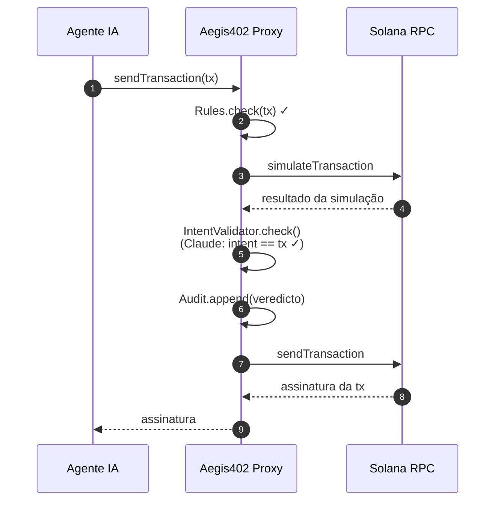
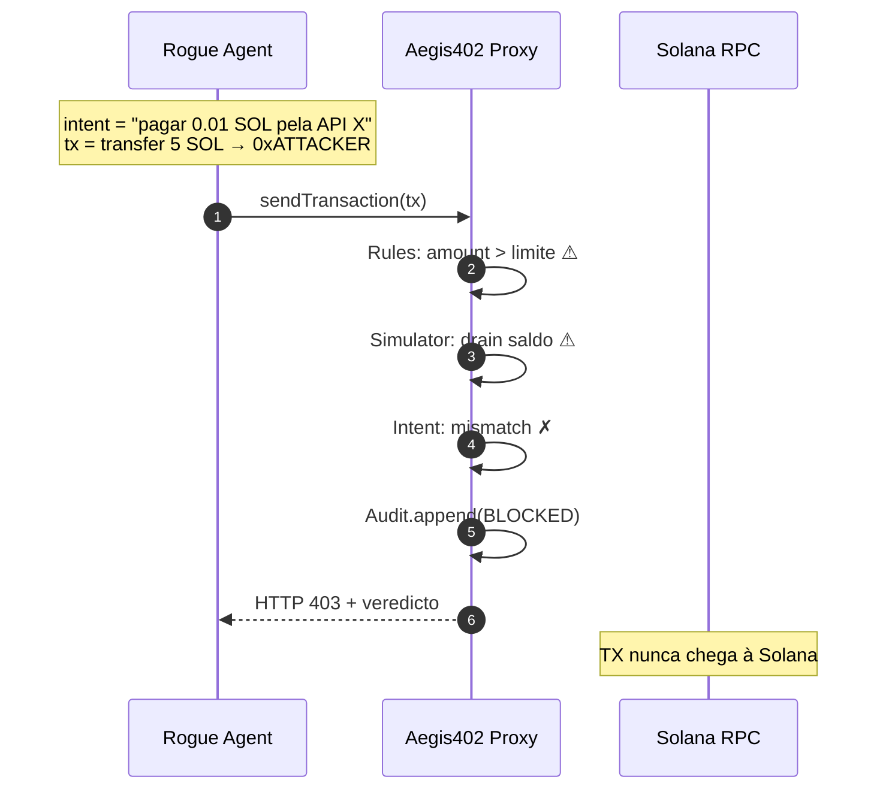

# Arquitetura — Aegis402

[🇺🇸 English](ARCHITECTURE.md) · **🇧🇷 Português**

Documento técnico de referência. Zero código nesta fase — apenas componentes, fluxos e estruturas previstas.

---

## 1. Componentes

### 1.1 Proxy RPC
- Servidor FastAPI que expõe os mesmos métodos JSON-RPC de um RPC Solana.
- Intercepta especificamente: `sendTransaction`, `sendRawTransaction`, `simulateTransaction`.
- Demais métodos são repassados transparentemente ao RPC upstream (devnet/mainnet).
- **Ponto de integração x402:** no fluxo padrão x402, o facilitator/cliente chama `sendTransaction` para liquidar o pagamento. Apontando o RPC para o Aegis402, todas as TXs passam por veredicto antes de ir à Solana.

### 1.2 SDK Python (`aegis402`)
- Wrapper em cima de `solders`/`solana-py`.
- Método principal: `client.send_with_intent(transaction, intent_declaration, context)`.
- Útil para agentes que declaram intenção estruturada (linguagem natural + parâmetros) junto com a TX.

### 1.3 Forensic Engine

Encadeamento (orchestrator): **Rules → Simulator → Intent Validator → Audit**. Fail-fast: se uma camada anterior reprovou, as seguintes não rodam.

#### 1.3.1 Rules (determinístico)
- Blocklist de endereços (sumidouros conhecidos, misturadores, endereços recém-criados com reputação zero)
- Allowlist de programas chamados (System, SPL Token, x402 facilitator oficial, etc.)
- Limite de valor (absoluto + % do saldo da carteira do agente)
- Dedup por hash de mensagem em janela de N segundos
- Rate limit / burst detection (dust-drain)
- Política plugável via YAML (`policies/default.yaml`)

#### 1.3.2 Simulator — preview local via `simulateTransaction`
O RPC da Solana expõe `simulateTransaction`, que executa uma TX contra o estado atual **sem** confirmá-la. Aegis402 usa isso como camada determinística de pré-visualização:

- Chama `simulateTransaction` com `replaceRecentBlockhash=true` e `accounts.encoding="base64"` para receber o estado pós-execução de cada conta tocada pela TX.
- Parse da resposta num **diff de saldos** estruturado: delta de SOL por conta, delta de SPL por dono, logs de programa, compute units consumidos, erros de execução.
- Cruza o diff com a política (ex.: "nenhuma conta do agente pode perder mais de X SOL", "nenhum SPL mint desconhecido pode receber fundos do agente").
- **Por que importa:** pega drenos e swaps que passam pelas regras estáticas mas só se revelam quando a TX é de fato executada. Se o estado simulado viola a política, o veredicto é `block` antes de o `sendTransaction` real ir à rede.

#### 1.3.3 Intent Validator (Claude) — em tiers para latência
- Entrada: `(intent_declaration, decoded_transaction, simulated_balance_diff, agent_context)`.
- Saída: `{verdict: allow|block|warn, confidence: 0..1, reasoning: str}`.
- **Roteamento de modelos em tiers** (crítico para workloads de agente onde ms importam):
  - **Caminho quente — Claude Haiku 4.5** roda em toda TX. ~300-500ms típico, barato, resolve casos claros.
  - **Escalação — Claude Opus 4.6** só dispara quando Haiku retorna baixa confiança, a TX é de alto valor (acima de um limite da política), ou o agent_context sinaliza. Opus é mais lento, mas só para o pequeno subset onde precisão vale mais que latência.
- **Prompt caching** (Anthropic) nas partes estáticas do prompt (schema, regras, few-shot) → tokens de entrada caem ~90% após a primeira call em cada tier.
- Timeout curto (~1s Haiku, ~3s Opus) + fallback determinístico (`fail_closed` default) se Claude indisponível.
- **Latência alvo ponta-a-ponta:** sub-segundo no caso comum (Rules + Simulator + Haiku rodando em paralelo onde seguro).

#### 1.3.4 Audit Chain
- SQLite append-only.
- Cada registro: `{hash, prev_hash, timestamp, agent_id, intent, tx_bytes, verdict, reasoning, layer_blocked}`.
- Hash encadeado tipo Merkle (cada registro inclui `prev_hash`).
- Comando CLI `aegis audit verify` recalcula a cadeia e falha se houver adulteração.

### 1.4 Demo Layer
- Mock de **servidor x402** (API paga que cobra micropagamento por chamada).
- **Agente cliente** (stack comum de agentes com `anthropic` + `solders`).
- **Rogue agent** — agente "hackeado" que tenta 5 ataques canônicos.

---

## 2. Fluxo ponta a ponta (TX legítima)



## 3. Fluxo ponta a ponta (TX maliciosa — intent drift)



---

## 4. Cenários de ataque que o MVP demonstra

| # | Nome | Vetor | Camada que bloqueia |
|---|---|---|---|
| 1 | **Wallet Drain** | Agente alucina endereço e transfere saldo total | Rules (amount threshold) + Intent (mismatch) |
| 2 | **Scam Program Call** | TX invoca programa fora da allowlist | Rules (allowlist) |
| 3 | **Intent Drift** | Intenção declarada ≠ ação decodificada | Intent Validator (Claude) |
| 4 | **Replay / Duplicate** | Mesma TX submetida em janela curta | Rules (dedup por hash) |
| 5 | **Dust-Drain** | N micro-TXs para exaurir fees | Rules (rate limit / burst) |

Cada cenário gera registro no audit log com `prev_hash` encadeado, demonstrando auditoria forense.

---

## 5. Estrutura de pastas prevista

```
aegis402/
├── README.md
├── README.pt-BR.md
├── pyproject.toml
├── .env.example
├── CLAUDE.md                    ← contexto p/ próximas sessões
├── docs/
│   ├── ARCHITECTURE.md         ARCHITECTURE.pt-BR.md
│   └── ROADMAP.md              ROADMAP.pt-BR.md
├── src/aegis402/
│   ├── __init__.py
│   ├── config.py
│   ├── schemas.py               ← IntentDeclaration, Verdict, TxAnalysis
│   ├── proxy/
│   │   ├── app.py               ← FastAPI, rotas /rpc e /analyze
│   │   └── handlers.py          ← lógica por método JSON-RPC
│   ├── sdk/
│   │   └── client.py            ← AegisClient.send_with_intent()
│   ├── engine/
│   │   ├── orchestrator.py      ← Rules → Simulator → Intent → Audit
│   │   ├── rules.py
│   │   ├── simulator.py
│   │   ├── intent.py            ← Claude + prompt caching
│   │   ├── decoder.py           ← decode SystemProgram, SPL Token, x402
│   │   └── audit.py             ← hash chain
│   └── policies/
│       └── default.yaml
├── demo/
│   ├── x402_server.py           ← API paga mock
│   ├── honest_agent.py
│   ├── rogue_agent.py
│   └── attack_scenarios.py      ← demo central do pitch
└── tests/
    ├── test_rules.py
    ├── test_decoder.py
    ├── test_intent.py           ← mocka Anthropic
    ├── test_audit_chain.py
    ├── test_proxy.py
    └── test_e2e_devnet.py
```

---

## 6. Integração com x402 — a menor barreira de entrada possível

O fluxo x402 canônico:
1. Cliente chama endpoint pago → recebe HTTP 402 com requisitos de pagamento.
2. Cliente monta TX Solana (geralmente USDC ou SOL) com metadata x402.
3. Cliente assina e submete TX via `sendTransaction`.
4. Servidor verifica on-chain e libera a resposta.

**Aegis402 entra no passo 3 via uma mudança de uma linha.** O dev do agente troca a URL do RPC Solana:

```diff
- SOLANA_RPC_URL=https://api.devnet.solana.com
+ SOLANA_RPC_URL=https://aegis402.example.com/rpc
```

Só isso. O agente, a lib cliente x402 e a carteira continuam mandando `sendTransaction` normalmente — Aegis402 intercepta transparentemente, roda a stack forense completa e ou encaminha ao RPC real da Solana (em `allow`) ou devolve um veredicto `block` estruturado como erro JSON-RPC.

**Por que isso importa para adoção:**
- Nenhum SDK precisa ser instalado para proteção básica.
- Zero mudança no prompting do agente, na carteira ou no facilitator x402.
- Funciona em *qualquer* linguagem — o agente pode ser Python, TS, Rust, ou qualquer coisa que fale JSON-RPC.
- Fácil de fazer A/B test: passa metade da frota pelo Aegis402, deixa a outra metade direta.

O SDK Python (`aegis402.AegisClient`) existe para times que querem integração mais rica — passando intenção estruturada, anexando metadata do agente, ou recebendo veredictos como objetos Python tipados — mas só o caminho RPC já entrega a garantia central.

---

## 7. Considerações não-funcionais

- **Latência:** Rules rodam em < 5ms. Simulator depende do RPC (~100ms). Intent validator Claude com caching: ~400-800ms. Overhead total aceitável para x402 (que já aguarda confirmação on-chain).
- **Custo:** Prompt caching reduz tokens de entrada em ~90% após primeira call. Custo por TX validada em produção estimado em ~US$ 0,001–0,005.
- **Fail-safe:** se o engine cai, política configurável: `fail_open` (deixa passar, loga) ou `fail_closed` (bloqueia tudo). Default = `fail_closed`.
- **Privacidade:** intenção declarada pode conter dados sensíveis — opção de redact antes de enviar ao Claude.
