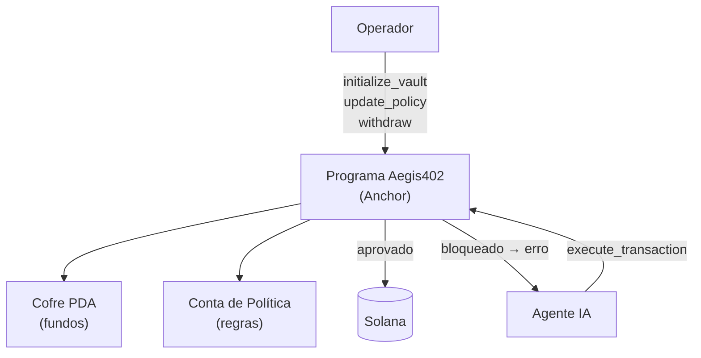
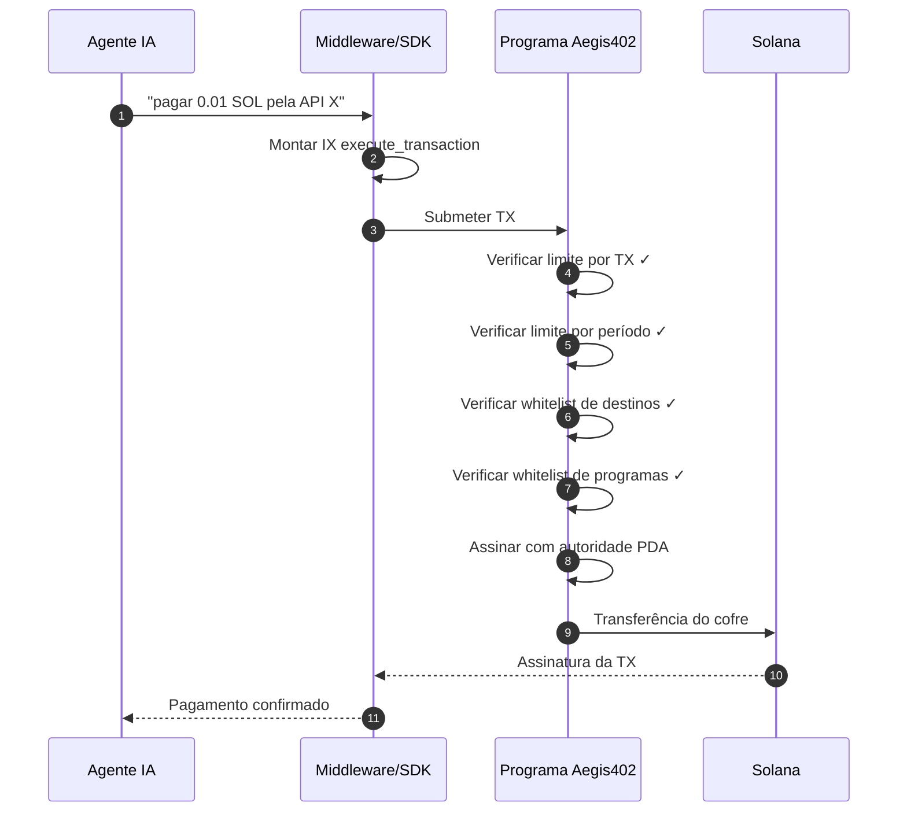
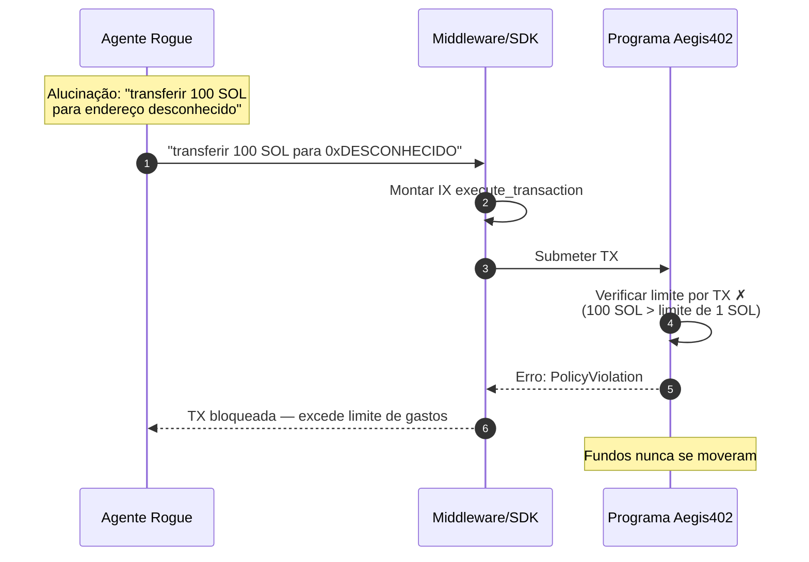

# Arquitetura — Aegis402

[🇺🇸 English](ARCHITECTURE.md) · **🇧🇷 Português**

Documento técnico de referência. Zero código nesta fase — apenas componentes, fluxos e estruturas previstas.

---

## 1. Componentes

### 1.1 Programa Solana (Rust / Anchor)

O núcleo do Aegis402. Um único programa on-chain que gerencia:

- **Cofres PDA:** cada agente (ou operador) recebe um cofre derivado de uma seed determinística. Fundos são depositados no cofre; o programa é a única autoridade para liberá-los.
- **Contas de Política:** contas on-chain que armazenam a política ativa de cada cofre — limites de gastos (por-TX e por-período), endereços de destino permitidos, program IDs permitidos (whitelist de protocolos) e rate limits.
- **Validação de Transações:** toda instrução de saque passa pela verificação completa das políticas antes do programa assinar com a autoridade PDA. Se qualquer regra falha, a TX é rejeitada on-chain — nenhum fundo se move.

Instruções principais:
| Instrução | Descrição |
|---|---|
| `initialize_vault` | Cria novo cofre PDA + conta de política para um agente/operador |
| `deposit` | Transfere SOL ou tokens SPL para o cofre |
| `execute_transaction` | Agente solicita saque — programa valida contra todas as políticas, assina com PDA se aprovado |
| `update_policy` | Operador atualiza limites, whitelists ou rate limits (requer autoridade do operador) |
| `withdraw` | Operador retira fundos do cofre (requer autoridade do operador) |

### 1.2 Middleware / SDK

Ponte entre o agente IA e o programa on-chain.

- **SDK TypeScript:** encapsula Solana Web3.js para construir instruções `execute_transaction` com a derivação PDA correta e contexto de política. Agentes chamam o SDK em vez de construir transações Solana cruas.
- **SDK Python (opcional):** wrapper leve para frameworks de agentes em Python (LangChain, CrewAI, etc.).
- **Integração x402:** gerencia o fluxo de pagamento HTTP 402 — quando uma API retorna 402, o middleware monta a TX de pagamento, roteia pelo programa Aegis402 e retorna o resultado ao agente.

### 1.3 Dashboard Web

Interface para operadores gerenciarem cofres e políticas.

- **Configuração de políticas:** definir limites de gastos (por-TX, diário, semanal), gerenciar whitelists de protocolos, configurar rate limits.
- **Monitoramento em tempo real:** feed ao vivo de transações passando pelos cofres, com veredicto (aprovado/bloqueado) e a regra de política que acionou.
- **Gestão de cofres:** depositar/sacar fundos, visualizar saldos, ver histórico de transações.
- **Trilha de auditoria:** log pesquisável de todos os veredictos com referências on-chain.

Construído com React / Next.js, conectando à Solana via Web3.js e lendo estado on-chain + histórico indexado.

### 1.4 Indexer

Escuta eventos on-chain emitidos pelo programa Aegis402 e armazena em banco de dados consultável para o dashboard.

- Rastreia: criação de cofres, depósitos, saques, atualizações de política, veredictos de transações.
- Fornece dados históricos que seriam caros de consultar on-chain repetidamente.

---

## 2. Arquitetura de Cofres PDA



### Derivação PDA

```
vault_pda = findProgramAddress(["vault", operator_pubkey, vault_id], program_id)
policy_pda = findProgramAddress(["policy", vault_pda], program_id)
```

O PDA do cofre é a **única autoridade** sobre os fundos. O programa assina com este PDA somente após todas as verificações de política passarem. Nem o agente nem o operador podem mover fundos fora do programa.

---

## 3. Aplicação de políticas — regras on-chain

| Regra | Descrição | Aplicação |
|---|---|---|
| **Limite por TX** | Valor máximo de SOL/token por transação | Verificado contra o valor da instrução |
| **Limite por período** | Gasto cumulativo máximo em janela de tempo (diário/semanal) | Rastreado via conta de contador on-chain |
| **Whitelist de destinos** | Apenas endereços aprovados podem receber fundos | Verificado contra destinatário na instrução |
| **Whitelist de programas** | Apenas programas aprovados podem ser chamados (ex.: SPL Token, facilitator x402) | Verificado contra program ID na instrução |
| **Rate limit** | Número máximo de TXs em janela de tempo | Rastreado via contador on-chain |

Todas as regras são armazenadas na conta de política e verificadas atomicamente em `execute_transaction`. Se qualquer regra falha, a TX inteira é rejeitada.

---

## 4. Fluxo ponta a ponta (TX legítima)



## 5. Fluxo ponta a ponta (TX bloqueada — violação de política)



---

## 6. Cenários de ataque defendidos pelo MVP

| # | Nome | Vetor | Regra que bloqueia |
|---|---|---|---|
| 1 | **Wallet Drain** | Agente alucina e transfere saldo total | Limite por TX + limite por período |
| 2 | **Protocolo não autorizado** | TX chama programa fora da whitelist | Whitelist de programas |
| 3 | **Intent Drift** | Intenção declarada não bate com destino | Whitelist de destinos |
| 4 | **Replay / Duplicata** | Mesma TX submetida múltiplas vezes | Rate limit |
| 5 | **Dust-Drain** | Muitas micro-TXs para exaurir taxas | Rate limit + limite por período |

Todos os veredictos são emitidos como eventos on-chain e indexados para a trilha de auditoria do dashboard.

---

## 7. Estrutura de pastas prevista

```
aegis402/
├── README.md
├── README.pt-BR.md
├── LICENSE
├── docs/
│   ├── ARCHITECTURE.md         ARCHITECTURE.pt-BR.md
│   └── ROADMAP.md              ROADMAP.pt-BR.md
├── programs/aegis402/          ← Programa Anchor
│   ├── Cargo.toml
│   └── src/
│       ├── lib.rs              ← entrypoint + dispatch de instruções
│       ├── state.rs            ← structs Vault, Policy
│       ├── instructions/
│       │   ├── initialize.rs
│       │   ├── deposit.rs
│       │   ├── execute.rs      ← lógica de enforcement de políticas
│       │   ├── update_policy.rs
│       │   └── withdraw.rs
│       └── errors.rs           ← PolicyViolation, etc.
├── sdk/                        ← SDK TypeScript
│   ├── package.json
│   └── src/
│       ├── client.ts           ← AegisClient
│       ├── pda.ts              ← helpers de derivação PDA
│       └── types.ts
├── app/                        ← Dashboard Next.js
│   ├── package.json
│   └── src/
│       ├── app/
│       │   ├── page.tsx        ← home do dashboard
│       │   ├── vaults/
│       │   └── policies/
│       └── components/
├── demo/
│   ├── honest_agent.ts
│   ├── rogue_agent.ts
│   └── attack_scenarios.ts
├── tests/
│   ├── aegis402.ts             ← testes Anchor
│   └── sdk.test.ts
├── Anchor.toml
└── package.json
```

---

## 8. Integração com x402

Fluxo x402 canônico:
1. Cliente chama endpoint pago → recebe HTTP 402 com requisitos de pagamento.
2. Cliente monta TX Solana com metadata x402.
3. Cliente submete TX para liquidar o pagamento.
4. Servidor verifica on-chain e libera a resposta.

**Aegis402 entra no passo 3.** Em vez do agente assinar e enviar a TX diretamente, o middleware constrói uma instrução `execute_transaction` que roteia o pagamento pelo cofre PDA. O programa on-chain aplica todas as políticas antes dos fundos se moverem.

**Por que isso importa para adoção:**
- Agentes nunca precisam de acesso direto a chaves privadas.
- Políticas são aplicadas no nível do smart contract — não podem ser contornadas por bugs do agente.
- Operadores podem definir limites de gastos apropriados para o caso de uso de cada agente.
- Funciona com qualquer serviço compatível com x402 sem modificações no lado do servidor.

---

## 9. Considerações não-funcionais

- **Segurança:** toda aplicação de políticas acontece on-chain. O middleware é camada de conveniência — mesmo comprometido, o programa on-chain rejeita transações violadoras.
- **Latência:** validação on-chain adiciona overhead mínimo (~200ms) além do tempo normal de confirmação de TX na Solana.
- **Custo:** taxas Solana (~0.000005 SOL por TX) + rent para contas de cofre/política (~0.002 SOL uma vez).
- **Fail-safe:** se o middleware cai, os fundos permanecem seguros nos cofres PDA — ninguém pode movê-los sem passar pelo programa.
- **Auditabilidade:** todo veredicto é um evento on-chain, totalmente verificável por qualquer explorer Solana ou indexer customizado.
